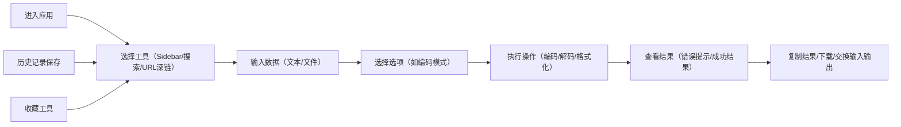

## 1. 产品概述

开发者在线工具箱是一款面向开发者、运维人员和测试工程师的纯前端工具聚合平台，提供高频开发辅助工具，所有计算均在浏览器本地完成，保障数据隐私安全。

- **目标用户**：开发者、运维工程师、测试人员、工具维护者
- **核心价值**：聚合常用开发工具于单页应用，无需后端服务，数据不出浏览器，快速访问常用编解码和序列化工具
- **市场定位**：替代零散的在线工具网站，提供统一、安全、高效的开发工具体验

## 2. 核心功能

### 2.1 用户角色

| 角色 | 注册方式 | 核心权限 |
|------|----------|----------|
| 普通用户 | 无需注册 | 使用所有工具功能、保存历史记录、收藏工具 |
| 工具维护者 | 无需注册 | 新增 tool module 配置化注册（代码层面） |

### 2.2 功能模块

1. **壳层与公共能力**：左侧工具导航 + 右侧工作区布局，主题切换，多语言支持，历史记录，收藏功能，URL 深链
2. **Base64 编解码**：文本/文件模式，标准/URL-safe 切换，MIME 换行，自动检测
3. **URL 编解码**：编解码、URL 解析、批量处理
4. **HTML 实体编解码**：命名实体转换、沙箱预览
5. **Unicode 转换**：文本转 Unicode、码点列表、Emoji 拆分
6. **JSON 工具**：格式化、压缩、校验、排序、YAML 互转
7. **JWT 解析**：Header/Payload 解析、过期时间转换、安全警告

### 2.3 页面详情

| 页面名称 | 模块名称 | 功能描述 |
|----------|----------|-------------|
| 主应用 | 左侧 Sidebar | 工具分类展示、模糊搜索（中英文）、收藏置顶、最近使用 |
| 主应用 | 顶部栏 | 深色模式切换、语言切换（zh/en）、关于与隐私弹窗 |
| 主应用 | 工具工作区 | 工具标题、说明、输入输出分栏、操作按钮（清空、复制、交换） |
| Base64 工具 | 文本模式 | UTF-8 与 Base64 互转，标准/URL-safe 切换，MIME 换行选项 |
| Base64 工具 | 文件模式 | 拖拽上传 ≤5MB 文件，编码为 Base64 或解码为 Blob 下载 |
| URL 工具 | 编解码 | encodeURIComponent/decodeURIComponent，批量处理 |
| URL 工具 | URL 解析 | 展示 protocol、host、pathname、search 等字段 |
| HTML 实体工具 | 编解码 | escape/unescape，命名实体转换 |
| HTML 实体工具 | 预览 | iframe sandbox 渲染结果，禁用脚本防 XSS |
| Unicode 工具 | 转换 | 文本 ↔ \\uXXXX / \\u{XXXXXX}，显示码点列表 |
| Unicode 工具 | Emoji | Emoji 拆分与码点查询 |
| JSON 工具 | 格式化 | 格式化/压缩、语法校验、错误位置高亮 |
| JSON 工具 | 转换 | 排序 keys、Unicode 不转义中文、JSON ↔ YAML 互转 |
| JWT 工具 | 解析 | Header/Payload JSON 美化，exp 转本地时间 |
| JWT 工具 | 安全 | 过期红标、alg=none 安全警告 |

## 3. 核心流程

### 3.1 用户使用流程

### 3.2 工具注册流程（维护者）

## 4. 用户界面设计

### 4.1 设计风格

- **主色调**：深色主题采用 slate/zinc 色系，搭配蓝色（#3b82f6）作为主强调色，绿色（#10b981）作为成功色，红色（#ef4444）作为错误色
- **按钮风格**：圆角 6px，hover 状态有轻微阴影和颜色变化，点击有缩放反馈
- **字体**：JetBrains Mono（代码区）+ Inter（界面文字），避免使用默认系统字体
- **布局风格**：三栏布局（Sidebar + 工具栏 + 工作区），卡片式设计，清晰的视觉层次
- **图标**：使用 lucide-vue-next 图标库，统一的线性图标风格

### 4.2 页面设计概述

| 页面名称 | 模块名称 | UI 元素 |
|----------|----------|----------|
| 主应用 | Sidebar | 深色背景，工具分类折叠展开，搜索框支持模糊匹配，收藏工具置顶显示 |
| 主应用 | 顶部栏 | 半透明背景，毛玻璃效果，工具标题，主题切换按钮，语言切换，关于按钮 |
| 主应用 | 工作区 | 输入/输出分栏布局（左右或上下切换），操作按钮组，错误提示 inline 显示 |
| 工具页面 | 输入区 | CodeMirror 6 编辑器，支持 JSON/文本模式，行号显示，语法高亮 |
| 工具页面 | 输出区 | CodeMirror 6 编辑器，只读模式，错误行高亮 |
| 工具页面 | 工具栏 | 清空、复制、交换、选项切换（下拉菜单/开关），快捷操作按钮 |

### 4.3 响应式设计

- **桌面端**：左侧固定 Sidebar（280px），右侧工作区自适应
- **平板端**：Sidebar 可折叠收起（64px 图标模式）
- **移动端**：Sidebar 采用抽屉模式（从左侧滑出），工具切换采用底部 sheet，输入输出上下布局

### 4.4 交互与动效

- **页面加载**：工具内容区淡入动画，Sidebar 逐项滑入
- **按钮交互**：hover 状态背景色变化 + 轻微阴影，click 状态缩放 0.98
- **Toast 提示**：右上角滑入，2秒后自动消失，复制成功/错误提示
- **错误提示**：输入框边框变红，错误信息 inline 显示，支持点击跳转到错误行
- **深色模式切换**：平滑过渡动画（0.3s），所有颜色变量动态切换
