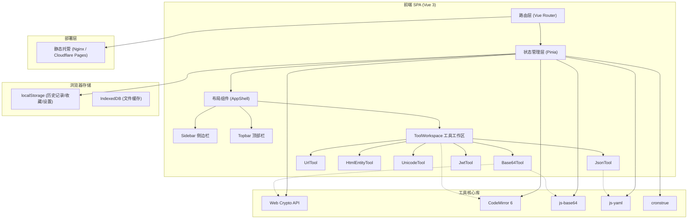

## 1. 架构设计



## 2. 技术描述

- **前端框架**：Vue 3.4+ + TypeScript 5.3+
- **构建工具**：Vite 5.2+
- **状态管理**：Pinia 2.1+
- **路由**：Vue Router 4.3+
- **UI 框架**：Tailwind CSS 3.4+ + shadcn-vue 组件风格
- **代码编辑器**：CodeMirror 6.15+
- **图标库**：lucide-vue-next 0.370+
- **编解码库**：js-base64 3.7+
- **YAML 处理**：js-yaml 4.1+
- **CRON 描述**：cronstrue 2.48+
- **国际化**：Vue I18n 9.10+
- **PWA**：Vite PWA 0.19+（可选）

## 3. 目录结构

```
src/
├── components/           # 公共组件
│   ├── layout/           # 布局组件
│   │   ├── AppShell.vue
│   │   ├── Sidebar.vue
│   │   ├── Topbar.vue
│   │   └── MobileDrawer.vue
│   ├── ui/               # shadcn 风格组件
│   │   ├── Button.vue
│   │   ├── Input.vue
│   │   ├── Select.vue
│   │   ├── Switch.vue
│   │   ├── Tabs.vue
│   │   ├── Dialog.vue
│   │   ├── Dropdown.vue
│   │   ├── Toast.vue
│   │   └── Tooltip.vue
│   ├── editor/           # CodeMirror 编辑器组件
│   │   ├── CodeEditor.vue
│   │   └── JsonEditor.vue
│   └── workspace/        # 工作区组件
│       ├── ToolWorkspace.vue
│       ├── ToolHeader.vue
│       └── ToolActions.vue
├── composables/          # 组合式函数
│   ├── useTheme.ts
│   ├── useI18n.ts
│   ├── useHistory.ts
│   ├── useFavorites.ts
│   ├── useClipboard.ts
│   ├── useToast.ts
│   └── useDeepLink.ts
├── pages/                # 页面组件
│   └── tools/            # 工具页面
│       ├── Base64Tool.vue
│       ├── UrlTool.vue
│       ├── HtmlEntityTool.vue
│       ├── UnicodeTool.vue
│       ├── JsonTool.vue
│       └── JwtTool.vue
├── stores/               # Pinia stores
│   ├── appStore.ts
│   ├── toolStore.ts
│   └── settingsStore.ts
├── router/               # 路由配置
│   └── index.ts
├── tools/                # 工具注册表与核心逻辑
│   ├── registry.ts       # 工具注册中心
│   ├── types.ts          # 工具类型定义
│   └── modules/          # 工具逻辑模块
│       ├── base64.ts
│       ├── url.ts
│       ├── htmlEntity.ts
│       ├── unicode.ts
│       ├── json.ts
│       └── jwt.ts
├── utils/                # 工具函数
│   ├── crypto.ts         # Web Crypto API 封装
│   ├── storage.ts        # 存储封装
│   ├── string.ts         # 字符串处理
│   └── file.ts           # 文件处理
├── locales/              # 国际化资源
│   ├── zh-CN.json
│   └── en-US.json
├── styles/               # 全局样式
│   ├── index.css
│   └── themes.css        # 主题变量
├── App.vue
└── main.ts
```

## 4. 路由定义

| 路由 | 用途 |
|-------|------|
| `/` | 首页，重定向到第一个工具 |
| `/tool/base64` | Base64 编解码工具 |
| `/tool/url` | URL 编解码工具 |
| `/tool/html-entity` | HTML 实体编解码工具 |
| `/tool/unicode` | Unicode 转换工具 |
| `/tool/json` | JSON 工具 |
| `/tool/jwt` | JWT 解析工具 |
| `/about` | 关于与隐私页面 |

## 5. 工具注册机制

### 5.1 工具类型定义

```typescript
interface ToolDefinition {
  id: string;
  name: {
    zh: string;
    en: string;
  };
  description: {
    zh: string;
    en: string;
  };
  icon: string;
  category: 'encode' | 'convert' | 'format' | 'crypto';
  keywords: string[];
  path: string;
  component: Component;
  options?: ToolOption[];
}

interface ToolOption {
  key: string;
  type: 'switch' | 'select' | 'input';
  label: { zh: string; en: string };
  defaultValue: any;
  options?: { value: string; label: { zh: string; en: string } }[];
}
```

### 5.2 工具注册示例

```typescript
// src/tools/registry.ts
import { defineTool } from './types';
import Base64Tool from '@/pages/tools/Base64Tool.vue';

export const base64Tool = defineTool({
  id: 'base64',
  name: { zh: 'Base64 编解码', en: 'Base64 Encoder/Decoder' },
  description: { 
    zh: '支持文本和文件的 Base64 编解码，标准/URL-safe 模式切换', 
    en: 'Base64 encode/decode for text and files, standard/URL-safe mode' 
  },
  icon: 'Binary',
  category: 'encode',
  keywords: ['base64', '编码', '解码', 'encode', 'decode'],
  path: '/tool/base64',
  component: Base64Tool,
  options: [
    {
      key: 'urlSafe',
      type: 'switch',
      label: { zh: 'URL-safe 模式', en: 'URL-safe mode' },
      defaultValue: false
    }
  ]
});
```

## 6. 数据模型

### 6.1 历史记录数据结构

```typescript
interface HistoryItem {
  id: string;
  toolId: string;
  input: string;
  output: string;
  options: Record<string, any>;
  timestamp: number;
}
```

### 6.2 收藏数据结构

```typescript
interface FavoriteItem {
  toolId: string;
  addedAt: number;
}
```

### 6.3 设置数据结构

```typescript
interface AppSettings {
  theme: 'light' | 'dark' | 'system';
  language: 'zh-CN' | 'en-US';
  layout: 'horizontal' | 'vertical';
  autoSaveHistory: boolean;
  maxHistoryItems: number;
  enableAnalytics: boolean;
}
```

### 6.4 本地存储键

```typescript
const STORAGE_KEYS = {
  HISTORY: 'devbox_history',
  FAVORITES: 'devbox_favorites',
  SETTINGS: 'devbox_settings',
  RECENT_TOOLS: 'devbox_recent_tools'
};
```

## 7. 核心模块说明

### 7.1 主题系统

- 使用 CSS 变量定义深浅两套主题
- 通过 `useTheme` composable 管理主题切换
- 支持跟随系统主题自动切换
- 主题切换时有平滑过渡动画

### 7.2 编辑器封装 (CodeMirror 6)

- 支持 JSON、纯文本等多种语言模式
- 行号显示、语法高亮、括号匹配
- 错误行高亮显示
- 支持只读模式
- 响应式高度自适应

### 7.3 加密模块

- 封装 Web Crypto API
- 支持 SHA-1、SHA-256 哈希计算
- 所有计算均在本地完成

### 7.4 Toast 通知系统

- 全局单例管理
- 支持成功、错误、信息、警告四种类型
- 自动消失，支持手动关闭
- 队列管理，支持多条通知堆叠

## 8. 部署说明

### 8.1 构建命令

```bash
npm run build      # 生产构建
npm run preview    # 预览构建结果
```

### 8.2 Nginx 配置示例

```nginx
server {
    listen 80;
    server_name devbox.example.com;
    root /var/www/devbox/dist;
    
    index index.html;
    
    location / {
        try_files $uri $uri/ /index.html;
    }
    
    location ~* \.(js|css|png|jpg|jpeg|gif|ico|svg|woff2?)$ {
        expires 1y;
        add_header Cache-Control "public, immutable";
    }
}
```

### 8.3 PWA 支持（可选）

- 通过 Vite PWA 插件实现
- 支持离线访问
- 支持添加到主屏幕
- 可通过配置项启用/禁用
